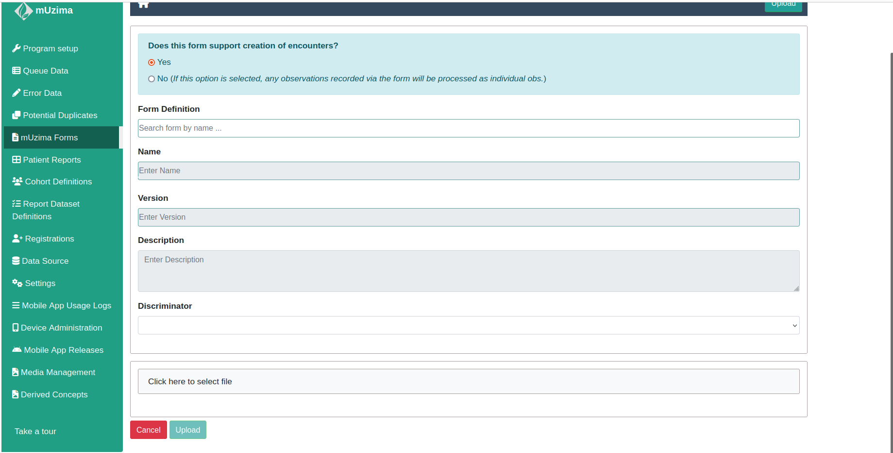

# APZU mUzima Forms

This repository contains all APZU mUzima forms.

## Table of Contents

1. [Installation](#installation)
2. [mUzima Management Tool](#muzima-management-tool)
3. [Creating mUzima Form](#creating-muzima-form)
4. [Set up mUzima Form on OpenMRS](#set-up-muzima-form-on-openmrs)
5. [Program Setup on OpenMRS](#program-setup-on-openmrs)
6. [Accesing mUzima on the phone](#accesing-muzima-on-the-phone)

## Installation

We install mUzima in OpenMRS as a module. The mUzima module is installed in OpenMRS by going to the `Administration` tab. Under this tab, go to `modules` and select the `upload module` button and browse for the mUzima module and upload it.

## mUzima Management Tool

If the installation on the mUzima module is successful, you should be be able to see the mUzima management tool under the `Administration` tab.

## Creating mUzima Form

Creating a new mUzima form from scratch can be tricky, I recomend duplicating an existing form and editing it to fit your needs.

You can clone this repository, duplicate an exisiting form and make edits or clone this [repository](https://github.com/muzima/muzima-form)

There is one thing that is you need to know before you create a form and it's that there are a number of fields that are required for each form.

1. Location
2. encounter date
3. Provider Name
4. Next appointment date

Make sure to include these in your form or else you'll encounter errors when uploading data to OpenMRS.

Now, let's create a mUzima form to be used to capture height when a patient meets a provider during a Teen Club Visit.This form is used to collect observations during follow up encounters and not to register patients during an initial encounter.

The first step is to duplicate an existing form. I will clone the [muzima form](https://github.com/muzima/muzima-form) repository and make a copy of this [form](https://github.com/muzima/muzima-form/blob/master/ScreeningEncounterForm.html)

Next, I will remove all the fields that I don't need from the form and remain with the Weight. The form will look like [this](./step2.html). You'll notice that I have left some fields because these are requied for each mUzima followup encounter form.

This is how the weight section looks like:

```html
<div class="section">
    <div class="form-group">
        </p><label for="obs.weight">Weight (KG)  <span class="required">*</span></label>
        <input class="form-control" id="obs.weight" name="obs.weight"
               type="number" placeholder="Kilograms" data-concept="5089^WEIGHT (KG)^99DCT" required="required">
    </div>
</div>
```

We need to update the `data-concept` tag with our information from OpenMRS. Let's get the `UUID` and the `Fully Specified Name` for the Weight concept.
In my case the UUID is `6569c44a-977f-11e1-8993-905e29aff6c1` and the Fully Specified Name is `Weight (kg)`.

We'll update the weight section in HTML to:

```html
<div class="section">
    <div class="form-group">
        </p><label for="obs.weight">Weight (KG)  <span class="required">*</span></label>
        <input class="form-control" id="obs.weight" name="obs.weight"
               type="number" placeholder="Kilograms" data-concept="6569c44a-977f-11e1-8993-905e29aff6c1^Weight (kg)^99DCT" required="required">
    </div>
</div>
```

We also need to update the `Proposed date of facility visit` and our form will look like [this](./step4.html). We can preview the form by opening it any broswer and fill it with the data and click submit, this helps to see what to expect when a user submits the form.

We're done creating the form and we'll need to upload it on the server.

## Set up mUzima Form on OpenMRS

After creating the form, we need to set up the form on OpenMRS. Open the form section in mUzima:


Click on `Upload` and you'll taken to this:


There are a number of things that we need to know before we upload the form.

1. Form Definition
   The form definition is the encounter for the particular form.

2. Name and Version
   If you select the form definition, the name and version are automatically field.

3. Discriminator
   Our form is a follow-up encounter, we need to select `json-encounter` as the discriminator.

4. Click `Click here to select file` to select your form and click on `Upload`.

If there are no error messages, your form will be uploaded successfuly.

## Program Setup on OpenMRS

We have created a form and we have uploaded it on OpenMRS, we need a way to access this from from a mobile device and this is where Program Setup comes in.

When using a mobile form to access mUzima, there are a number of things that need to be downloaded. We can download all these components individualy or we can bundle all the components together and download them at once. Program Setup allows us to bundle all the components together.

Let's go to program setup:


Click on `Set up a new program` and select `Advanced`:


We see there are different components under program set up:

- Forms
- Cohorts
- Locations
- Providers
- Concepts
- Settings
- Report Dataset definitions
- Users
- Media Management
- Derived Concepts

We don't have to worry about using them all for now. Let's go to `Forms` and select the form that we created. Under `Cohort`, I created a cohort using Cohort Builder in OpenMRS and I'll select that cohort. For `Location`, let's search for 'Lisungwi Community Hospital' and select it. On `Providers`, let's search for 'Absen Tebulo' and select that as our provider. When we get to `Concepts`, it automatically checks the concepts that we have specified on our form. Let's select all the concepts, after all they are only two concepts that we have used on the form.

We don't need the to edit the Settings, Report Dataset definitions, Users, Media Management and Derived Concepts for now.

Let's save our set up and remember to give the program set up a name.

## Accesing mUzima on the phone

You can download the mUzima app on google play store. However, the app from play store might not be updated.

As of current, I have the latest version and you can download it [here](./apk/muzima-android-debug-3.3.2-SNAPSHOT.apk)

Install the app and open it:


Enter the URL of your OpenMRS server, your username and password.

After a successful login, you'll see a list of Progam Setups. Select the Program Setup that you created and it'll download all the components of that program set up.
